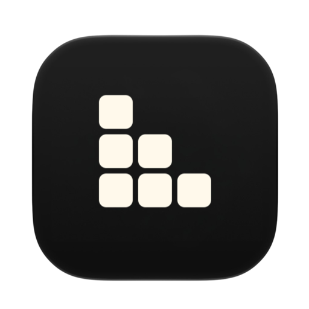
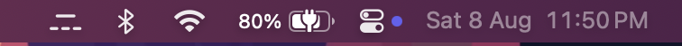
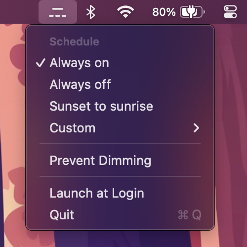
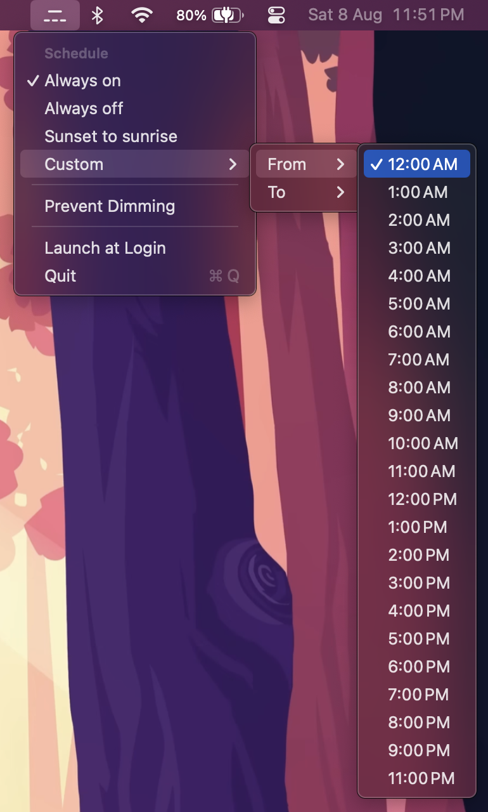

# Nocturne
### Your keyboard backlight, on a schedule.

*Leggimi in [italiano](README.it.md).*

Nocturne is a small menu bar app that turns the built-in keyboard backlight off when you don't need it: all day, on a schedule you set, or from sunrise to sunset wherever you are. It hands it back untouched when you're done.

[](https://github.com/gabriele-rizzo/Nocturne/releases/latest)


[](LICENSE)
<!-- [](https://example.com) -->

> [!NOTE]
> Nocturne isn't notarized, so macOS blocks it the first time you open it. [Installation](#installation) has the one time fix.

<a href="https://www.buymeacoffee.com/gabrielerizzo" target="_blank"></a>

### Installation

Download the latest release, drag Nocturne into your Applications folder, and launch it. It lives in the menu bar and has no window and no Dock icon.

With Homebrew instead:

```
brew tap gabriele-rizzo/nocturne https://github.com/gabriele-rizzo/Nocturne
brew trust gabriele-rizzo/nocturne
brew install --cask nocturne
```

Homebrew asks you to trust a tap that isn't one of its own before it will run the cask.

The first time you open it, macOS will refuse, saying it cannot check the app for malicious software. This is expected: Nocturne isn't notarized. To let it through, open **System Settings**, go to **Privacy & Security**, and scroll down to the security section. There you'll find a line saying Nocturne was blocked, with an **Open Anyway** button next to it. Click that, confirm with your password or Touch ID, and Nocturne starts.

Control-clicking the app and choosing Open used to work, but macOS 15 removed that shortcut, so System Settings is the way now.

If you'd rather do it from the terminal, this has the same effect:

```
xattr -dr com.apple.quarantine /Applications/Nocturne.app
```

Either way you only do it once. Updates install without asking again.

You can also build it yourself. See [Building](#building).

### Usage

Nocturne puts an icon in the right side of your menu bar. Click it to choose when the backlight should be off.



There are four schedules:

- **Always on**: Nocturne stays out of the way and the backlight behaves normally.
- **Always off**: the backlight stays off.
- **Sunset to sunrise**: the backlight is off during daylight and comes back when it gets dark. Uses civil twilight, so it switches when it's actually dark rather than at the moment the sun crosses the horizon.
- **Custom**: pick the hours the backlight should be off.



Custom schedules are set from the submenu, one hour for the start and one for the end. Windows that run past midnight are fine, so 22:00 to 07:00 works as you'd expect.



**Pause for an Hour** puts the schedule aside and gives the backlight back for an hour, for when you need to see the keys right now. It appears whenever a schedule could be holding the light off, and turns into **Resume Schedule** while it's running. The schedule picks up again on its own when the hour is up.

**Prevent Dimming** stops macOS from fading the keyboard backlight after a minute of inactivity. It's off by default, and Nocturne puts your original setting back when it quits.

**Launch at Login** starts Nocturne automatically. macOS may ask you to approve it in System Settings the first time.

Sunset to sunrise needs your location to work out when the sun rises and sets. Nocturne only ever computes times locally, and nothing is sent anywhere. Because it's a menu bar app, macOS may not show a permission prompt, so the menu offers a shortcut to the Location Services settings if it needs granting.

### Updates

Nocturne can update itself, and it downloads and installs in place, so there is nothing to drag into your Applications folder a second time.

It won't check on its own until you say it can. Once you've been using it for a little while, Nocturne asks the question once, and takes no for an answer. **Settings…** in the menu, or ⌘A, opens a window where you can check right now, change your mind about the automatic checks, or let updates install without being asked first.

Every release is signed with a key that only the project holds, and Nocturne installs nothing that fails to match it.

### Building

Requires macOS 15.7 or later and Xcode 26 or later.

```
git clone https://github.com/gabriele-rizzo/Nocturne.git
cd Nocturne
open Nocturne.xcodeproj
```

No signing setup is needed, because the project builds ad-hoc out of the box.

To sign with your own Apple developer team instead, create a `Local.xcconfig` next to the project:

```
DEVELOPMENT_TEAM = YOURTEAMID
CODE_SIGN_IDENTITY = Apple Development
```

It's gitignored, so it stays out of the repository.

Run the tests with:

```
xcodebuild test -project Nocturne.xcodeproj -scheme Nocturne -destination 'platform=macOS'
```

### Releasing

Pushing a `v` tag is the whole process. The workflow builds the disk image, signs a zip for the updater, writes the appcast and publishes all three.

The version comes from the tag, so there is nothing to edit first. `Scripts/version.sh` turns `v1.2.0` into a marketing version of `1.2.0` and a build number of `10200`, packing major, minor and patch so the number always rises. The version in the project file is only what local and rolling builds report.

Release notes are the commit subjects since the previous `v` tag, with the version bumps left out, so those subjects are read by anyone updating.

Signing the update needs the Sparkle private key in a repository secret named `SPARKLE_PRIVATE_KEY`, matching the public key in `Signing.xcconfig`.

### FAQ

##### Does this drain or damage anything?

No. Nocturne only sets the keyboard backlight brightness, the same value the F5 and F6 keys change. Everything it touches is restored when it quits.

##### Why does the backlight come back on by itself sometimes?

macOS drives the keyboard backlight from the ambient light sensor and dims it after a minute of inactivity. While Nocturne is holding the backlight off it turns the ambient light sensor off so the two don't fight, and it turns it straight back on afterwards, so the backlight stays responsive to the room whenever it's allowed to be on.

##### Does it work with an external keyboard?

Nocturne targets the built-in keyboard. External keyboards manage their own backlight and aren't affected.

##### Why isn't it on the App Store?

Nocturne uses a private Apple framework to reach the keyboard backlight, because there's no public API for it. That rules out the App Store, and it also means a future macOS release could change the interface and break it. If Nocturne stops working after a system update, that's the likely cause, so please open an issue.

##### What happens if it crashes while the backlight is off?

It records what it changed, so the next launch puts your brightness, dim timer and ambient light setting back rather than leaving the keyboard dark.

### Translations

Nocturne is available in English and Italian. Translations live in `Nocturne/Localizable.xcstrings` and `Nocturne/InfoPlist.xcstrings`, which open as string catalogs in Xcode. Adding a language is a self-contained contribution: pick it in the catalog editor, fill in the values, and add the language code to the project's known regions.

### License

Nocturne is released under the [PolyForm Noncommercial License 1.0.0](LICENSE). You're free to use, modify and share it for any noncommercial purpose. Selling it, or using it as part of a commercial product or service, is not permitted.
